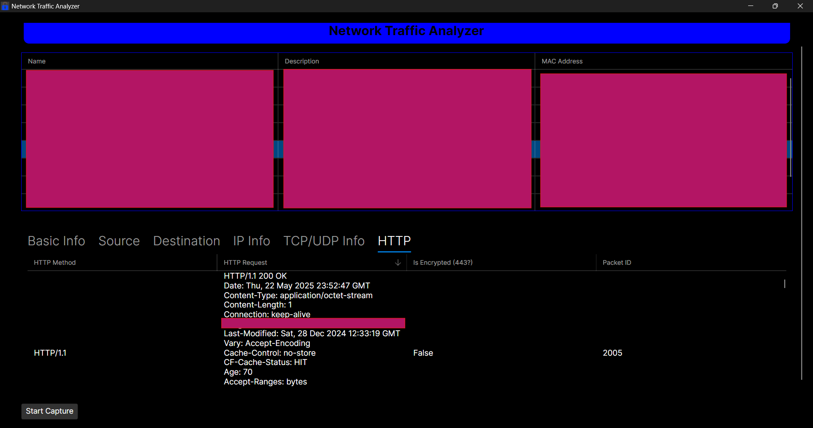

# Network-Traffic-Analyzer

## Important

- The network traffic analyzer is still in development, so the documentation will remain empty until it is complete.

## Information

A C# network traffic analyzer with Avalonia UI, capable of capturing and displaying real-time network data, such as packet headers and HTTP request/response info. While being capable of extracting detailed packet information such as source and destination IP and MAC addresses, protocol types, ports, packet sizes, timestamps, and network metadata like TTL and IP header length. The analyzer also displays TCP flags, payload sizes, encryption status, and HTTP methods and requests. Additionally, it'll assign a date and time of the captued packet being recieved along with a unique packet ID assigned to every packet.

## Coming Soon

- Search options for every category.
- Stop and pause option
- Filtering, such as those similae to Wireshark
- Bandwidth usage
